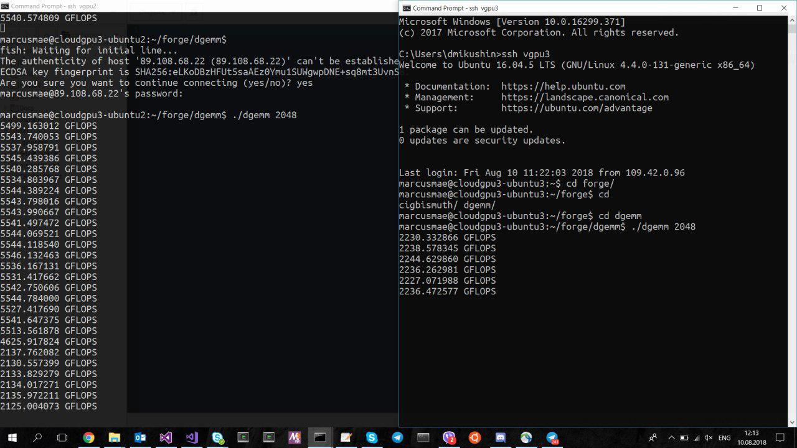

## GPU workload simulation with matrix-matrix multiplication in a loop

A basic test to get GPU busy with a highly-efficient compute-bound workload. Generate random double precision matrices of the given size, copy them from host to GPU and multiply (DGEMM) in a loop.

### Building on Linux

CUDA toolkit must be in the $PATH.

```
make
```

### Deployment

Specify matrix size as the first argument. Larger sizes are likely to saturate GPU resources. Smaller sizes are likely to leave some GPU compute cores stale.

```
./dgemm 2048
```



